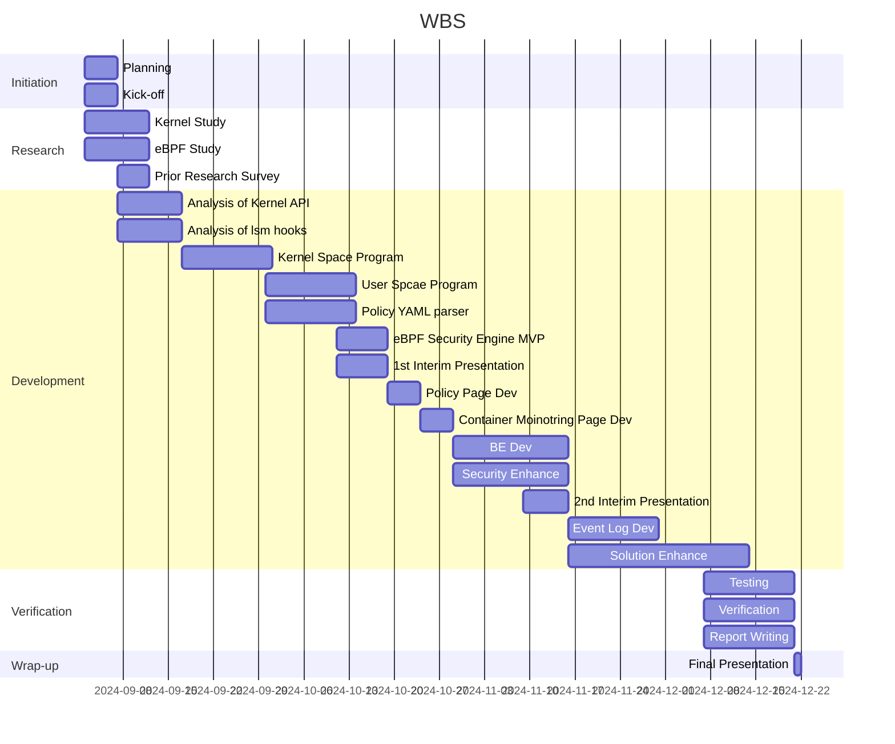

# BoB 13th Project - Team Yamong_1337

Development of an eBPF-based container runtime solution

## Project Structure

## WBS

## Contributor
* PM: Changhyun Lee ([eeche](https://github.com/eeche))
* Yejune Ko ([koyejune0302](https://github.com/KoYejune0302))
* HyeonSeok Kim ([persona-twotwo](https://github.com/persona-twotwo))
* Mingyu Jeong ([tomorrow9913](https://github.com/tomorrow9913))
* SungHyun Jeon ([nukunga](https://github.com/nukunga))
* Harksu Lim ([harksu](https://github.com/harksu))
